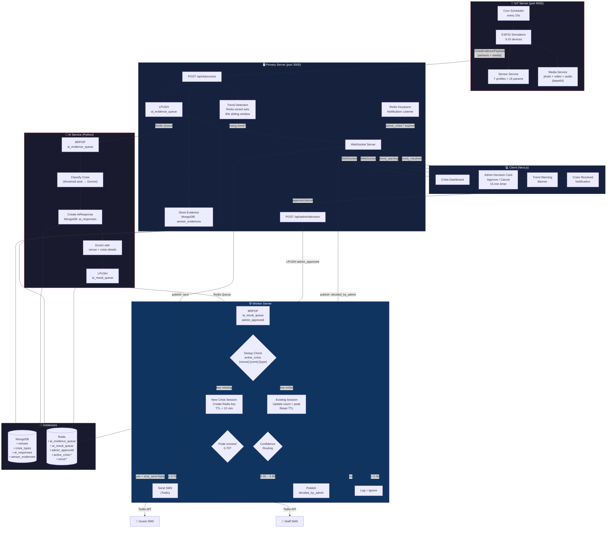
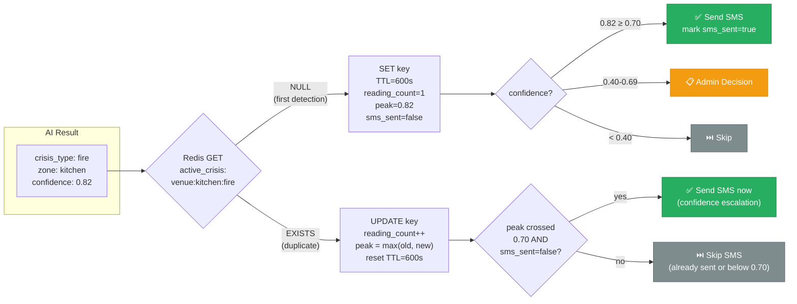
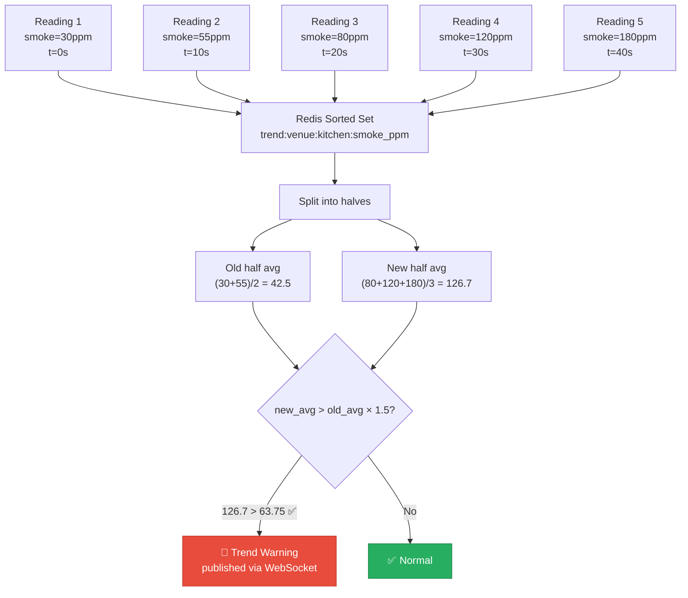
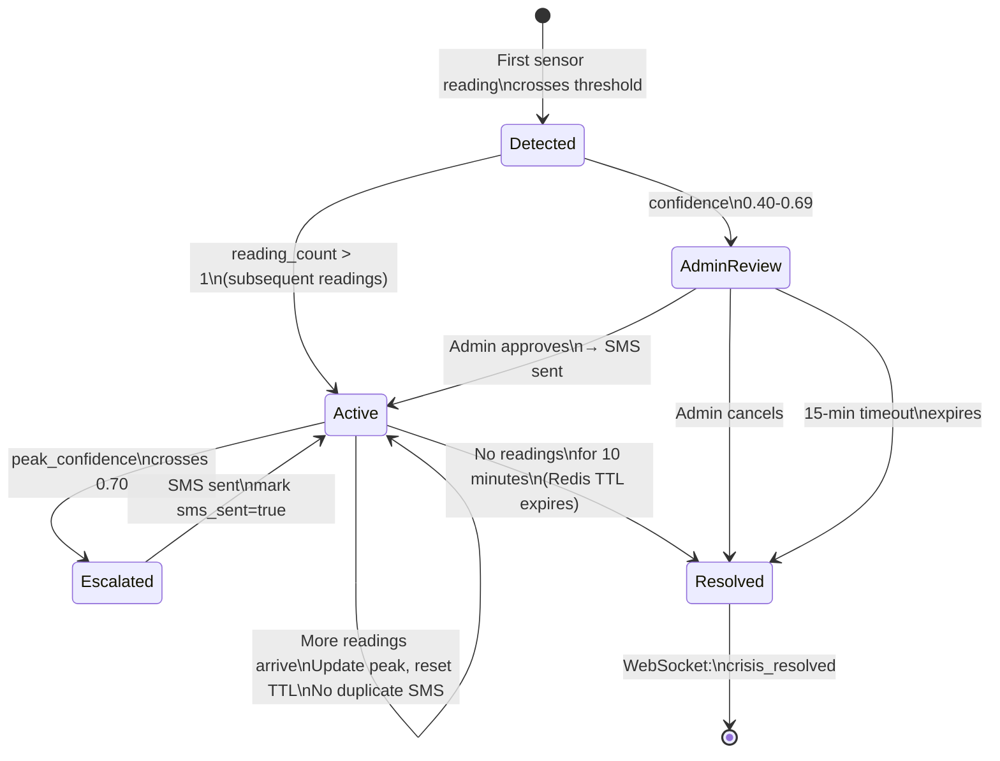
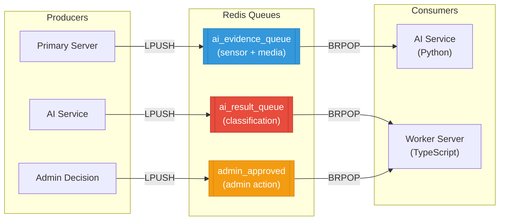

# Rapid Crisis Detection — System Design

## Complete Workflow

```mermaid
flowchart TD
    subgraph IOT["🔌 IoT Server (port 4000)"]
        ESP["ESP32 Simulators\n3-10 devices"]
        CRON["Cron Scheduler\nevery 10s"]
        SENSOR["Sensor Service\n7 profiles × 15 params"]
        MEDIA["Media Service\nphoto + video + audio\n(base64)"]
        
        CRON --> ESP
        ESP --> SENSOR
        ESP --> MEDIA
    end

    subgraph PRIMARY["🖥️ Primary Server (port 3000)"]
        API["POST /api/ai/process"]
        MONGO_STORE["Store Evidence\nMongoDB: sensor_evidences"]
        TREND["Trend Detection\nRedis sorted sets\n60s sliding window"]
        QUEUE_PUSH["LPUSH\nai_evidence_queue"]
        WS["WebSocket Server"]
        ADMIN_EP["POST /api/admin/decision"]
        KEYSPACE["Redis Keyspace\nNotification Listener"]
    end

    subgraph AI["🤖 AI Service (Python)"]
        BRPOP_AI["BRPOP\nai_evidence_queue"]
        CLASSIFY["Classify Crisis\n(threshold stub → Gemini)"]
        MONGO_WRITE["Create AiResponse\nMongoDB: ai_responses"]
        ENRICH["Enrich with\nvenue + crisis details"]
        LPUSH_RESULT["LPUSH\nai_result_queue"]
    end

    subgraph WORKER["⚙️ Worker Server"]
        BRPOP_WORKER["BRPOP\nai_result_queue\nadmin_approved"]
        DEDUP{"Dedup Check\nactive_crisis:\n{venue}:{zone}:{type}"}
        NEW_CRISIS["New Crisis Session\nCreate Redis key\nTTL = 10 min"]
        EXISTING["Existing Session\nUpdate count + peak\nReset TTL"]
        ESCALATION{"Peak crossed\n0.70?"}
        CONFIDENCE{"Confidence\nRouting"}
        SMS_SEND["Send SMS\n(Twilio)"]
        ADMIN_PUSH["Publish\ndecided_by_admin"]
        IGNORE["Log + Ignore"]
    end

    subgraph CLIENT["💻 Client (Next.js)"]
        DASHBOARD["Crisis Dashboard"]
        ADMIN_CARD["Admin Decision Card\nApprove / Cancel\n15-min timer"]
        TREND_UI["Trend Warning\nBanner"]
        RESOLVE_UI["Crisis Resolved\nNotification"]
    end

    subgraph STORAGE["💾 Databases"]
        MONGODB[("MongoDB\n• venues\n• crisis_types\n• ai_responses\n• sensor_evidences")]
        REDIS[("Redis\n• ai_evidence_queue\n• ai_result_queue\n• admin_approved\n• active_crisis:*\n• trend:*")]
    end

    ESP -->|"CrisisEvidencePayload\n(sensors + media)"| API
    API --> MONGO_STORE
    API --> TREND
    TREND -->|"rising trend?"| WS
    API --> QUEUE_PUSH

    QUEUE_PUSH -->|"Redis Queue"| BRPOP_AI
    BRPOP_AI --> CLASSIFY
    CLASSIFY --> MONGO_WRITE
    MONGO_WRITE --> ENRICH
    ENRICH --> LPUSH_RESULT

    LPUSH_RESULT -->|"Redis Queue"| BRPOP_WORKER
    BRPOP_WORKER --> DEDUP

    DEDUP -->|"key exists"| EXISTING
    DEDUP -->|"key missing"| NEW_CRISIS

    EXISTING --> ESCALATION
    ESCALATION -->|"yes + sms_sent=false"| SMS_SEND
    ESCALATION -->|"no"| IGNORE

    NEW_CRISIS --> CONFIDENCE
    CONFIDENCE -->|"≥ 0.70"| SMS_SEND
    CONFIDENCE -->|"0.40 – 0.69"| ADMIN_PUSH
    CONFIDENCE -->|"< 0.40"| IGNORE

    SMS_SEND -->|"Twilio API"| GUEST["📱 Guest SMS"]
    SMS_SEND -->|"Twilio API"| STAFF["📱 Staff SMS"]
    SMS_SEND -->|"publish: sent"| WS

    ADMIN_PUSH -->|"publish: decided_by_admin"| WS
    WS -->|"WebSocket"| DASHBOARD
    WS -->|"WebSocket"| ADMIN_CARD
    WS -->|"trend_warning"| TREND_UI

    ADMIN_CARD -->|"approve/cancel"| ADMIN_EP
    ADMIN_EP -->|"LPUSH admin_approved"| BRPOP_WORKER

    KEYSPACE -->|"active_crisis:* expired"| WS
    WS -->|"crisis_resolved"| RESOLVE_UI

    MONGO_STORE --> MONGODB
    MONGO_WRITE --> MONGODB
    QUEUE_PUSH --> REDIS
    LPUSH_RESULT --> REDIS
    NEW_CRISIS --> REDIS

    style IOT fill:#1a1a2e,stroke:#e94560,color:#fff
    style PRIMARY fill:#16213e,stroke:#0f3460,color:#fff
    style AI fill:#1a1a2e,stroke:#e94560,color:#fff
    style WORKER fill:#0f3460,stroke:#533483,color:#fff
    style CLIENT fill:#16213e,stroke:#0f3460,color:#fff
    style STORAGE fill:#1a1a2e,stroke:#533483,color:#fff
```

---

## Deduplication Flow (Zoomed In)

```mermaid
flowchart LR
    subgraph INPUT["AI Result"]
        R["crisis_type: fire\nzone: kitchen\nconfidence: 0.82"]
    end

    R --> CHECK{"Redis GET\nactive_crisis:\nvenue:kitchen:fire"}

    CHECK -->|"NULL\n(first detection)"| CREATE["SET key\nTTL=600s\nreading_count=1\npeak=0.82\nsms_sent=false"]
    CREATE --> ROUTE{"confidence?"}
    ROUTE -->|"0.82 ≥ 0.70"| SEND["✅ Send SMS\nmark sms_sent=true"]
    ROUTE -->|"0.40-0.69"| ADMIN["📋 Admin Decision"]
    ROUTE -->|"< 0.40"| SKIP["⏭️ Skip"]

    CHECK -->|"EXISTS\n(duplicate)"| UPDATE["UPDATE key\nreading_count++\npeak = max(old, new)\nreset TTL=600s"]
    UPDATE --> ESC{"peak crossed\n0.70 AND\nsms_sent=false?"}
    ESC -->|"yes"| SEND2["✅ Send SMS now\n(confidence escalation)"]
    ESC -->|"no"| SKIP2["⏭️ Skip SMS\n(already sent or below 0.70)"]

    style SEND fill:#27ae60,stroke:#1e8449,color:#fff
    style SEND2 fill:#27ae60,stroke:#1e8449,color:#fff
    style ADMIN fill:#f39c12,stroke:#d68910,color:#fff
    style SKIP fill:#7f8c8d,stroke:#566573,color:#fff
    style SKIP2 fill:#7f8c8d,stroke:#566573,color:#fff
```

---

## Trend Detection Flow

```mermaid
flowchart TD
    R1["Reading 1\nsmoke=30ppm\nt=0s"] --> ZSET["Redis Sorted Set\ntrend:venue:kitchen:smoke_ppm"]
    R2["Reading 2\nsmoke=55ppm\nt=10s"] --> ZSET
    R3["Reading 3\nsmoke=80ppm\nt=20s"] --> ZSET
    R4["Reading 4\nsmoke=120ppm\nt=30s"] --> ZSET
    R5["Reading 5\nsmoke=180ppm\nt=40s"] --> ZSET

    ZSET --> SPLIT["Split into halves"]
    SPLIT --> OLD["Old half avg\n(30+55)/2 = 42.5"]
    SPLIT --> NEW["New half avg\n(80+120+180)/3 = 126.7"]
    OLD --> CMP{"new_avg > old_avg × 1.5?"}
    NEW --> CMP
    CMP -->|"126.7 > 63.75 ✅"| WARN["🔔 Trend Warning\npublished via WebSocket"]
    CMP -->|"No"| OK["✅ Normal"]

    style WARN fill:#e74c3c,stroke:#c0392b,color:#fff
    style OK fill:#27ae60,stroke:#1e8449,color:#fff
```

---

## Crisis Lifecycle

```mermaid
stateDiagram-v2
    [*] --> Detected: First sensor reading\ncrosses threshold

    Detected --> Active: reading_count > 1\n(subsequent readings)
    
    Active --> Active: More readings arrive\nUpdate peak, reset TTL\nNo duplicate SMS

    Active --> Escalated: peak_confidence\ncrosses 0.70
    Escalated --> Active: SMS sent\nmark sms_sent=true

    Active --> Resolved: No readings\nfor 10 minutes\n(Redis TTL expires)
    
    Resolved --> [*]: WebSocket:\ncrisis_resolved

    Detected --> AdminReview: confidence\n0.40-0.69
    AdminReview --> Active: Admin approves\n→ SMS sent
    AdminReview --> Resolved: Admin cancels
    AdminReview --> Resolved: 15-min timeout\nexpires
```

---

## Queue Architecture

```mermaid
flowchart LR
    subgraph PRODUCERS["Producers"]
        PS["Primary Server"]
        AIS["AI Service"]
        AD["Admin Decision"]
    end

    subgraph QUEUES["Redis Queues"]
        Q1[["ai_evidence_queue\n(sensor + media)"]]
        Q2[["ai_result_queue\n(classification)"]]
        Q3[["admin_approved\n(admin action)"]]
    end

    subgraph CONSUMERS["Consumers"]
        AI_C["AI Service\n(Python)"]
        WK["Worker Server\n(TypeScript)"]
    end

    PS -->|"LPUSH"| Q1
    AIS -->|"LPUSH"| Q2
    AD -->|"LPUSH"| Q3

    Q1 -->|"BRPOP"| AI_C
    Q2 -->|"BRPOP"| WK
    Q3 -->|"BRPOP"| WK

    style Q1 fill:#3498db,stroke:#2980b9,color:#fff
    style Q2 fill:#e74c3c,stroke:#c0392b,color:#fff
    style Q3 fill:#f39c12,stroke:#d68910,color:#fff
```
